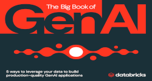
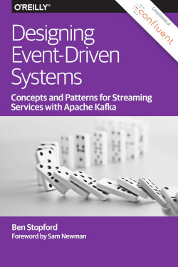
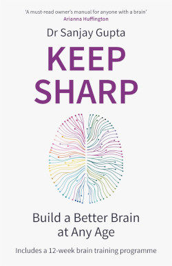

<h1 style="text-align: center;">Hi there 👋, I'm Mohamed Elmedany</h1>
<h3 style="text-align: center;">Senior Software Engineer | Software Architect | Chapter Lead | Java & Kotlin | Distributed Systems | DDD | AI-Assisted AI-Augmented</h3>

  
  
  

---

### 👨‍💻 About Me

Software engineer focused on building scalable, domain-driven systems and evolving them safely. I move comfortably between architecture and hands-on development, improving code, teams, and delivery.

AI-assisted development is part of my daily workflow to accelerate design, testing, and refactoring.

Pragmatic, curious, and focused on long-term maintainability.

---

### 🛠️ My Stack

Includes, but is not limited to, the following:

---

###  Currently Reading

---

### 📚 Recently Read

