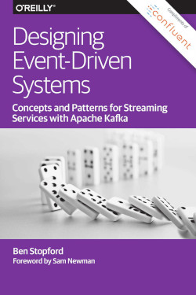
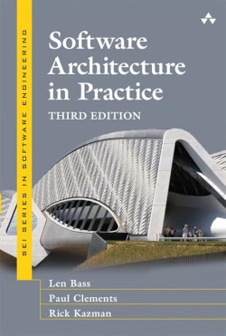

<h1 style="text-align: center;">Hi there 👋, I'm Mohamed Elmedany</h1>
<h3 style="text-align: center;">Senior Software Engineer | Java Enthusiast</h3>

  
  
  
  

---

### 👨‍💻 About Me

I'm a very experienced Software Engineer with over 10 years of experience in the software development field, particularly within the Java Ecosystem. I have a strong foundation in architecture design and optimization, and I am a certified Scrum Master. My current focus is expanding my knowledge in data and machine learning.

---

### 🛠️ My Stack

Includes, but is not limited to, the following:

[//]: # (---)

[//]: # ()
[//]: # (### 📜 Certifications)

[//]: # ()
[//]: # (- Certified Scrum Master &#40;CSM&#41;)

[//]: # (- Oracle Certified Professional, Java SE 11 Developer)

[//]: # (- Google Cloud Professional Data Engineer)

[//]: # (- Docker Certified Associate &#40;DCA&#41;)

[//]: # (- Kubernetes Certified Application Developer &#40;CKAD&#41;)

---

###  Currently Reading

---

### 📚 Recently Read

    
    
    
    

