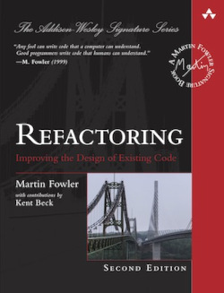
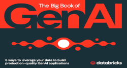
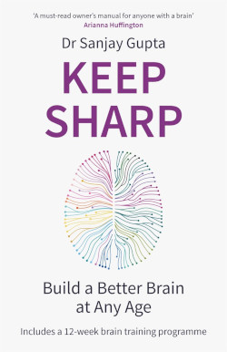

<h1 style="text-align: center;">Hi there 👋, I'm Mohamed Elmedany</h1>
<h3 style="text-align: center;">Senior Software Engineer | Certified Architect | Certified Scrum Master</h3>

  
  
  
  

---

### 👨‍💻 About Me

For me, Software Engineering isn't just a job, it's a lifestyle that I absolutely love. I thrive on the ever-evolving challenges and exciting opportunities in the tech world, and I approach each project with dedication and genuine enthusiasm. My commitment to excellence, paired with a proactive mindset, keeps me on the lookout for cutting-edge skills to stay ahead in this dynamic field.

I genuinely enjoy the unpredictability in software engineering, always ready to dive into innovative solutions and make a meaningful impact. In this fast-paced environment, I find inspiration in pushing the boundaries and staying ahead of the curve.

At the moment, beside expanding more on software architecture practices, I'm learning more about data and machine learning.

---

### 🛠️ My Stack

Includes, but is not limited to, the following:

---

###  Currently Reading

---

### 📚 Recently Read

